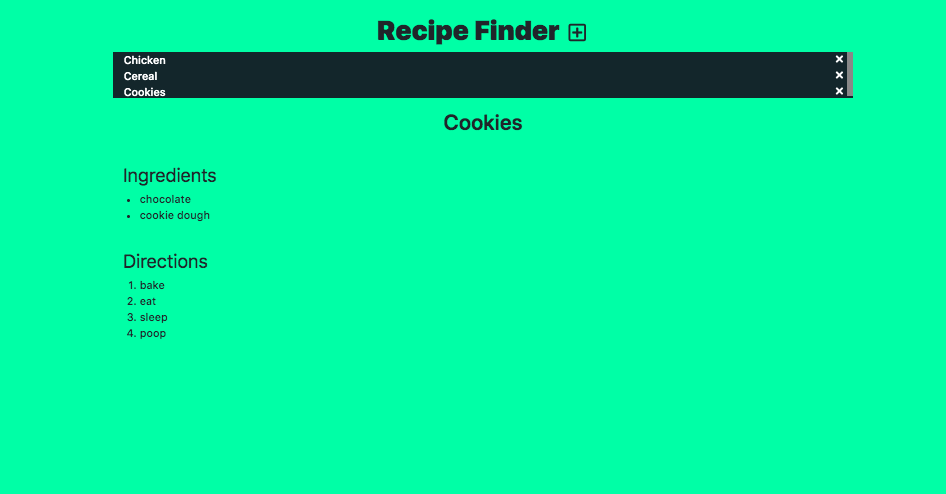

# Recipe Finder

## Description
This is a recipe finder. The initial motivation for this app was because I wanted to build something with React.js. The inital user stories can be found on the freecodecamp website. 

##Technology used
1. React.js
2. CSS
3. HTML5
4. JQuery
5. Bootstrap

## Screenshot of working APP

## Gif of working APP

